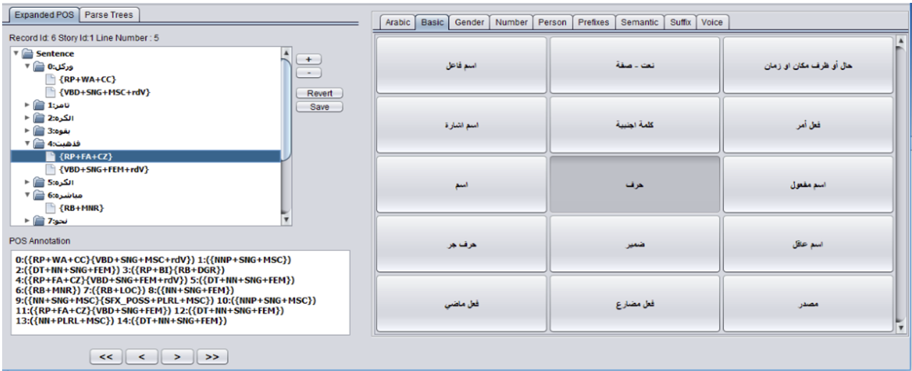

# Bracket Based Arabic Annotation

A simple tool to annotate Arbic Text for research purposes.

References:
  - [A Proposed Adaptive Scheme for Arabic Part-of Speech Tagging](https://thesai.org/Downloads/Volume8No7/Paper_10-A_Proposed_Adaptive_Scheme_for_Arabic_Part_of_Speech.pdf)

